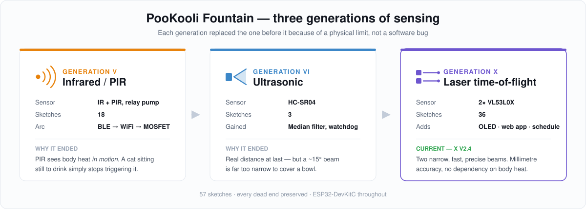
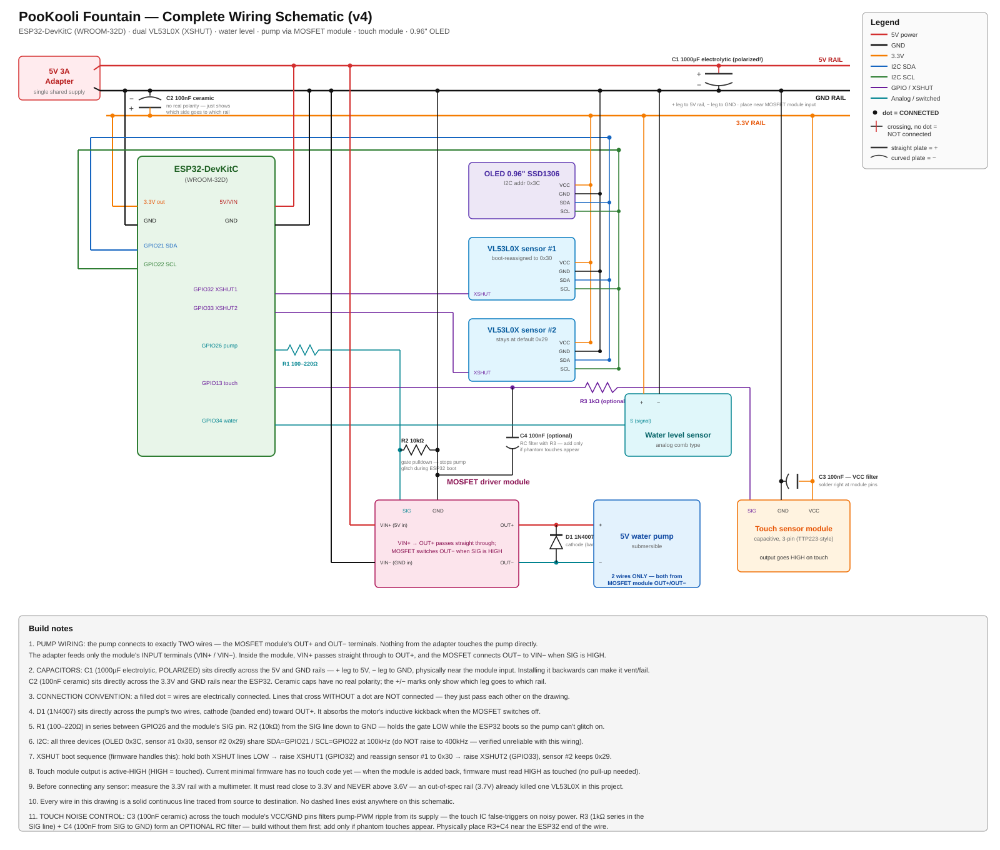

<div align="center">

# 🐱 PooKooli Fountain

**A smart, sensor-driven cat water fountain built on the ESP32 — traced from its first infrared prototype through to a polished, self-diagnosing release.**


</div>

---

## What it is

My cat wouldn't drink from a still bowl. So I built a fountain that notices when she
arrives and runs the pump for her — then kept rebuilding it until it was genuinely
reliable.

The current release detects the cat with **two laser time-of-flight sensors**, drives a
pump through a **MOSFET at ten power levels**, shows status on an **OLED**, and serves a
full **web dashboard** from the ESP32 itself — schedules, activity log, live sensor
readouts, and crash diagnostics that survive a reboot.

This repository is not just the final firmware. It is the **entire development history**:
three complete generations of sensing hardware, 65 sketches, every dead end included.

<div align="center">
  
</div>

---

## The three generations

Each generation replaced the *sensing* approach because the previous one hit a physical
wall that no amount of code could fix.

| Gen | Folder | Sensing | Versions | Why it ended |
|:---:|---|---|:---:|---|
| **V** | [`1-infrared/`](1-infrared/) | IR / PIR + relay | 18 | PIR detects *body heat in motion* — a cat sitting still to drink stops triggering it. Relay also proved noisy and slow. |
| **VI** | [`2-ultrasonic/`](2-ultrasonic/) | HC-SR04 ultrasonic | 3 | Reliable distance, but a ~15° beam is far too narrow. Miss the cone by a few centimetres and the cat is invisible. |
| **X** | [`3-laser/`](3-laser/) | 2× VL53L0X laser ToF | 44 | **Current.** Two narrow, fast, precise beams cover the bowl properly. Millimetre distance, no heat dependency. |

The jump is visible in the code: Gen V starts with **BLE** and a **relay**, ends with WiFi
and a MOSFET. Gen X starts from a deliberately stripped-down base and adds one module at a
time, each verified in isolation first.

> **Current stable release → [`stable/`](stable/) — PooKooli Fountain X V2.7**

---

## Features (current release)

**Sensing & control**
- 2× VL53L0X laser ToF sensors on one I²C bus (`XSHUT` address reassignment to `0x30`/`0x31`)
- Per-sensor trigger distance, adjustable live from the web app (5–70 cm)
- Capacitive touch as a universal manual override — stops any run, or starts one
- **BLE remote** — a cheap iTag keyfob connects directly as a BLE client (no phone app), its
  button toggling the pump like a physical universal-override switch
- Analogue water-level sensor, median-filtered over 7 samples, with a low-water cutoff that
  blocks the pump
- MOSFET pump drive via LEDC PWM, ten power levels, with soft-start and soft-stop

**Web app** (served entirely from the ESP32 — no cloud, no app store)
- Sidebar dashboard that collapses to a drawer on phones
- Time-of-day **Schedule** with per-day selection and one-shot entries
- **Recent Activity** log — pump starts/stops, blocks, settings changes
- **Device Info** — WiFi/IP/RSSI/MAC, uptime, heap, chip model, firmware version
- Embedded photo header, favicon and PWA icon, all served from flash

**Reliability** — the part that took the longest
- Hardware task watchdog with a verified configuration
- **Boot History** in flash: reset reason + free heap + a crash-location breadcrumb, all
  surviving the crash itself
- Automatic I²C bus recovery on sensor dropout, plus a manual button
- Pump forced OFF on every boot; hard 5-minute safety cap on laser-renewed runs

---

## Wiring

The full schematic lives in [`assets/schematic.svg`](assets/schematic.svg) — dual VL53L0X
with XSHUT, water level, pump MOSFET, touch module and OLED on an ESP32-DevKitC.

<div align="center">
  
</div>

| Module | Connections |
|---|---|
| VL53L0X #1 | `VCC`→3.3V · `GND`→GND · `SDA`→GPIO21 · `SCL`→GPIO22 · `XSHUT`→GPIO32 → addr `0x30` |
| VL53L0X #2 | `VCC`→3.3V · `GND`→GND · `SDA`→GPIO21 · `SCL`→GPIO22 · `XSHUT`→GPIO33 → addr `0x31` |
| Water level | `S`→GPIO34 (ADC1 ch6, input-only) |
| OLED SSD1306 | `SDA`→GPIO21 · `SCL`→GPIO22 · addr `0x3C` (shares the sensor bus) |
| Touch sensor | `SIG`→GPIO13 (active-HIGH, driven output) |
| Pump MOSFET | `PWM`→GPIO26 |

The BLE remote (a generic iTag keyfob) needs no wiring — it pairs over Bluetooth, which
shares the ESP32's radio with WiFi.

⚠️ **Protect the board.** A DC pump will brown out or crash an ESP32 that shares its rail.
Fit a flyback diode across the motor and a bulk capacitor on the supply — see
[`docs/HARDWARE.md`](docs/HARDWARE.md). This was a genuine, repeated failure mode here, not
a theoretical one.

---

## Quick start

```bash
git clone https://github.com/devhimoco/CatFountain.git
```

1. Open `stable/V43AlfaX-V2.7-Debug-WaterLevelFix/` in the Arduino IDE.
2. Install **Adafruit VL53L0X**, **Adafruit SSD1306**, **Adafruit GFX**, and **NimBLE-Arduino**
   (for the BLE remote); select board **ESP32 Dev Module**.
3. Set your WiFi credentials, upload, and open the Serial Monitor at `115200` to find the device IP.
4. Browse to that IP.

Full instructions, including the credentials-in-a-secrets-file pattern and the timezone
setting: **[`docs/SETUP.md`](docs/SETUP.md)**

---

## Repository map

```
CatFountain/
├── 1-infrared/      Gen V   — 18 sketches, IR/PIR + relay  (BLE → WiFi → MOSFET)
├── 2-ultrasonic/    Gen VI  —  3 sketches, HC-SR04
├── 3-laser/         Gen X   — 44 sketches, VL53L0X
│   ├── ModuleTest/          —  6 isolated per-module test rigs
│   ├── Beta/                — 17 test-track builds (V1.0 → V1.6)
│   └── Alfa-X/              — 21 complete editions (X V1.0 → X V2.7)
├── stable/          The release you should actually flash
├── assets/          Schematic, photos, diagrams
├── docs/            SETUP.md · HARDWARE.md
├── CHANGELOG.md     Every version, what changed, and why
└── VERSION-MANIFEST.md   How the archive was reorganised (original → current names)
```

Each folder has its own README with a per-version breakdown.

---

## Versioning scheme

The convention used throughout the sketch headers:

- **BETA Vx.y** — test track. `+0.1` for each module proven and added.
- **X Vx.y** — complete edition. `+0.1` for a small change, `+1.0` for a big one.

So `BETA V1.6` is the last test build, `X V1.0` is the first complete edition, and
`X V2.0` earned its full point for a ground-up UI rewrite plus two new subsystems.

---

## Notes & credits

- `1-infrared/V18-CorrectUseFirstTime-LATEST/` is an **HC-SR04 test sketch from
  [Rui Santos / RandomNerdTutorials](https://RandomNerdTutorials.com/esp32-hc-sr04-ultrasonic-arduino/)**,
  used under its own permissive notice. It sits at the end of Gen V because that is
  chronologically where the pivot to ultrasonic began — the bridge into Gen VI.
- [`Notes-MustDo.txt`](Notes-MustDo.txt) is the original hand-written to-do list from the
  earliest days. It is kept verbatim; several items were eventually built (non-stop
  pumping while the cat stays in range, trigger-source locking), and it is a fair snapshot
  of where the project started.
- The 433 MHz remote (YK04 + PT2272-M4) was tested and **deliberately dropped** — see
  [`3-laser/ModuleTest/`](3-laser/ModuleTest/). Motor EMI beat it even with an antenna and
  filtering; WiFi control proved far more robust.
- The build actually running on the physical fountain right now is **X V2.4** — the
  `V35`/`V39` sketch in `3-laser/Alfa-X/`.

## License

[MIT](LICENSE) — use it, change it, build your cat a fountain.
Third-party code retains its original attribution as noted above.
